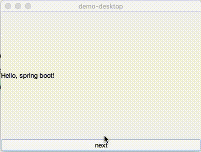

# Demo desktop
This is a proof of concept for developing a desktop application with spring framework and java swing.

  

## Enable GUI in spring 
We start a console application with the spring starter, this will give us a project with the spring-boot-starter dependencies.
````xml
    ...
    
    <dependencies>
        <dependency>
            <groupId>org.springframework.boot</groupId>
            <artifactId>spring-boot-starter</artifactId>
        </dependency>
    
        <dependency>
            <groupId>org.springframework.boot</groupId>
            <artifactId>spring-boot-starter-test</artifactId>
            <scope>test</scope>
        </dependency>
    </dependencies>

    ...
````

By default the framework disables input from peripherals such as monitor, mouse and keyboard. We must set the java.awt.headless system property to true; our main method will look like this:

````java
public static void main(String[] args) {
    System.setProperty("java.awt.headless", "false");
    SpringApplication.run(DemoDesktopApplication.class, args);
}
````

